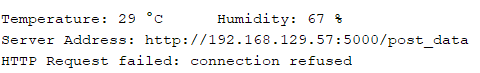
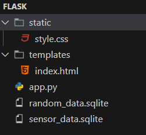
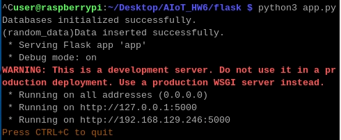
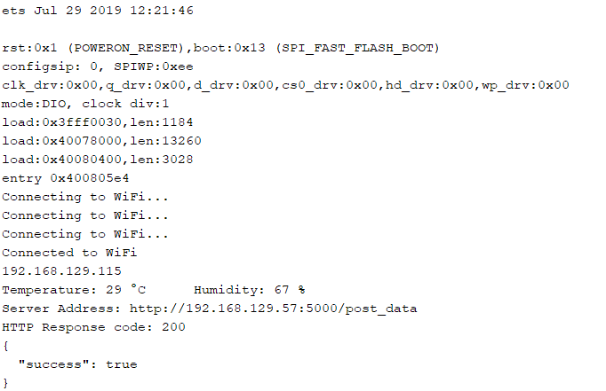
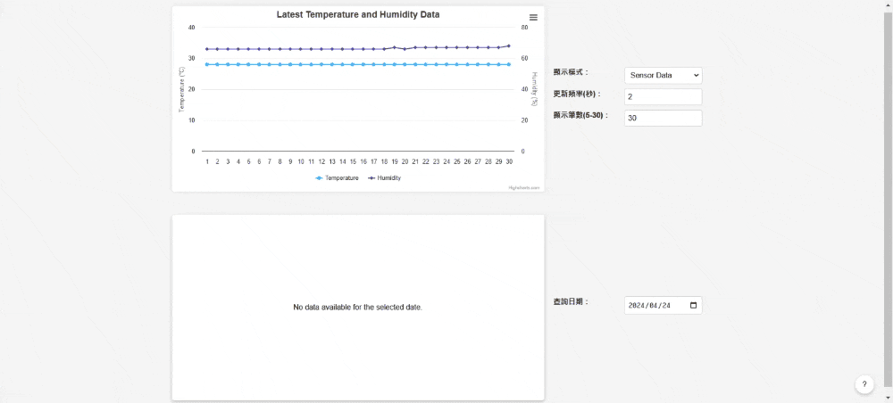
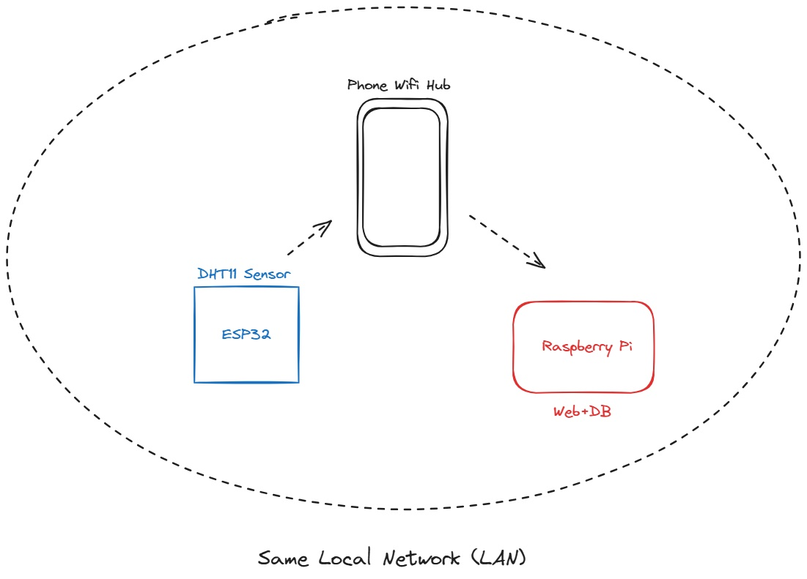

# AIoT_HW6
- 本專案為物聯網作業，使用Raspberry Pi 4進行實作，透過ESP32連接DHT11，取得溫溼度資料， 在樹莓派上用flask架設伺服器，接收溫溼度數據並儲存到資料庫，最後在網頁上渲染資料並動態更新。
## 1.Raspberry Pi 4 刷機
- 下載raspberry pi imager，並安裝到一張64GB記憶卡
- 下載完，開啟並選擇正確的版本後刷機
- 刷機完成後，將MicroSD卡放置到Rpi4背面，並接上電源線、螢幕連接線、鍵盤、滑鼠後，開機
- 開機後，進行初始化設定（設定名稱、密碼、時區等資訊）
- 將Rpi4連接網路（本次使用手機熱點）
## 2.取得溫溼度資料
- ESP32接上DHT11，並連結自己的電腦
- 開啟Adruino執行[tempToDB.ino](<tempToDB/tempToDB.ino>)，獲取溫濕度數值
- 執行結果如下圖
- 
- 可看到溫溼度資料已取得，但尚未開啟伺服器，因此還無法Post資料
## 3.架設伺服器
- 開啟終端機執行以下指令
```
sudo apt update
sudo apt install python3
sudo apt install python3-pip
sudo pip3 install flask
```
- 編寫flask應用程式，架構如下
- 
- 詳細程式碼在[flask](<flask/>)資料夾內
- 開啟終端機執行以下指令
```
python3 app.py
```
- 開啟伺服器
- 
- 再次查看Adruino的輸出資訊，如下圖
- 
- 可以看到資料已經資料Post成功
## 4.網頁渲染結果
- 
## 5.整體架構
- 
## 6.參考資料
- https://github.com/sc0210/3311_Lab6_student